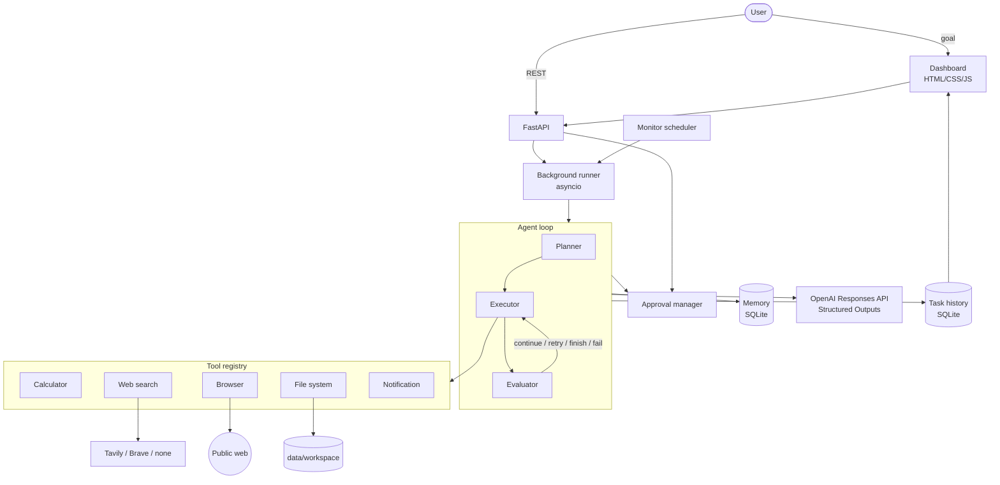

# Dot Lab

[](https://github.com/Anjub004/dot-lab/actions/workflows/ci.yml) [](https://www.kaggle.com/code/anju004/dot-lab-always-on-ai-agent-walkthrough)

An experimental always-on AI agent that plans, uses tools, maintains memory, executes multi-step tasks, and requests human approval when needed.

> **This project is not affiliated with, endorsed by, or an implementation of OpenAI Dots.**
> Dot Lab is an independent experimental project inspired by the general concept of autonomous, always-on AI agents.

---

## What is Dot Lab?

Dot Lab is a small, readable, working implementation of an *agentic* workflow. Instead of sending one prompt to an LLM and returning one answer, you give Dot Lab a **goal** and it:

1. understands the goal and creates a structured **plan** (validated Pydantic models, not string parsing),
2. picks a **tool** for each step and generates the tool's arguments,
3. **executes** each step with timeouts, retries and error handling,
4. stores results and observations in persistent **memory**,
5. **evaluates** each result and decides what to do next (continue, retry, finish early, or stop),
6. **pauses for human approval** before sensitive actions,
7. keeps running in the **background** while you watch progress in a dashboard,
8. evaluates whether the goal is achieved, adds steps if needed (bounded), and produces a **final result**,
9. keeps the complete **task history** (plan, events, tool calls, approvals, memory).

It also has an experimental **monitoring mode** that re-runs a goal on a schedule and notifies you only when something meaningful changed.

## Why this project exists

"Always-on" agents raise interesting engineering questions: how should an agent break work down, how do you stop it looping forever, where does human judgement come in, what should it remember, and how do you keep it from touching things it shouldn't? Dot Lab is an educational/research codebase for exploring those questions with code you can read in an afternoon. It favours clarity over cleverness and documents every simplification.

## Architecture



### The agent loop

```text
while task is PLANNING/RUNNING:
    reload state from DB            # sees pause/cancel immediately
    stop if MAX_AGENT_ITERATIONS reached
    if no plan:      create plan (LLM -> PlannerOutput, validated against tool registry)
    step = next unfinished step
    if no step:      evaluate goal -> COMPLETE, or add steps (max MAX_REPLANS times)
    if tool step:    generate args (validated against the tool's Pydantic input model)
                     if approval needed -> record request, WAITING_APPROVAL, exit loop
                     execute tool (timeout + retries for transient errors)
    else:            reasoning step (LLM)
    record tool call, events, memory
    evaluate step -> continue | retry (bounded) | finish early | fail
```

The whole run is wrapped in `TASK_TIMEOUT_SECONDS`. All state is in SQLite, so a task can resume after an approval, a pause or a restart.

## Features

- **Goal → plan → act → evaluate** loop with iteration limit, task timeout, per-tool timeout, bounded retries and bounded re-planning.
- **Structured outputs** everywhere the LLM is used (planner, tool arguments, step evaluation, goal evaluation, monitor comparison) via `client.responses.parse(text_format=...)`.
- **Modular tools** behind a common `BaseTool` interface: calculator (safe AST evaluator), web search (pluggable providers), read-only browser (SSRF-protected), sandboxed file system, notifications (dashboard + webhook).
- **Human-in-the-loop approvals**: webhook messages, file overwrites, steps the planner marks sensitive, and any tool listed in `APPROVAL_REQUIRED_TOOLS`. The approved input is executed exactly — it is never regenerated.
- **Persistent memory** (`save` / `retrieve` / `search` / `delete`) in SQLite with keyword search; relevant memories from earlier tasks are given to the planner.
- **Background execution** with asyncio, concurrency limit, pause / resume / cancel, and recovery of interrupted tasks on restart.
- **Monitoring mode** (experimental): scheduled goals, LLM-based change detection, notify only on meaningful change.
- **Dashboard**: overview cards, task list, task detail (goal, plan, current step, history, tool calls, memory, approvals, final result), approval panel, monitors and notifications.
- **Structured JSON logging** with secret redaction.
- **Optional API key** protection for the HTTP API.
- **Offline test suite** (no API key or network needed).

## Tech stack

Python 3.12+, FastAPI, Pydantic v2, SQLAlchemy 2 + SQLite, OpenAI Python SDK (Responses API), httpx, python-dotenv, asyncio, pytest, Ruff. Frontend: plain HTML, CSS and JavaScript (no build step).

## Project structure

```text
dot-lab/
├── app/
│   ├── main.py              # FastAPI app factory, lifespan, static dashboard
│   ├── config.py            # Settings from environment / .env
│   ├── context.py           # Wires all components together (used by API + examples)
│   ├── logging_config.py    # JSON logs + secret redaction
│   ├── api/                 # routes.py (system/memory/notifications), tasks.py,
│   │                        # approvals.py, monitors.py, schemas.py, deps.py
│   ├── agent/               # agent.py (loop), planner.py, executor.py,
│   │                        # evaluator.py, state.py, llm.py
│   ├── memory/              # memory.py (MemoryStore + SQLite impl), models.py
│   ├── tools/               # base.py, calculator.py, web_search.py, browser.py,
│   │                        # filesystem.py, notifications.py
│   ├── approvals/           # manager.py
│   ├── database/            # database.py (engine/session), models.py (tables)
│   └── services/            # task_service.py, runner.py (background), monitoring.py
├── dashboard/               # index.html, styles.css, app.js
├── examples/                # research_agent.py, monitoring_agent.py, simple_task.py
├── tests/                   # offline pytest suite with a scripted fake LLM
├── .github/workflows/ci.yml # lint + tests on every push
├── data/                    # SQLite DB + agent workspace (git-ignored)
├── .env.example  Dockerfile  docker-compose.yml  pyproject.toml  requirements.txt
└── README.md  SECURITY.md  CONTRIBUTING.md  LICENSE
```

Additions to the suggested layout, and why: `app/context.py` (single place that builds dependencies, avoids circular imports), `app/agent/llm.py` (LLM abstraction so tests can use a fake), `app/services/runner.py` (background execution kept separate from task persistence), `app/api/monitors.py`, `schemas.py`, `deps.py`, and `app/logging_config.py`.

## Installation

```bash
git clone https://github.com/Anjub004/dot-lab.git
cd dot-lab
python3.12 -m venv .venv
source .venv/bin/activate          # Windows: .venv\Scripts\activate
pip install -r requirements.txt
cp .env.example .env
```

## Configuration

Edit `.env`. The minimum is:

```dotenv
OPENAI_API_KEY=sk-...
OPENAI_MODEL=<a model that supports Structured Outputs on the Responses API>
```

Dot Lab does not hard-code a model name; choose one from the [OpenAI models page](https://platform.openai.com/docs/models).

Optional but recommended for research goals:

```dotenv
SEARCH_PROVIDER=tavily        # or: brave
SEARCH_API_KEY=...
```

| Variable | Purpose |
|---|---|
| `OPENAI_API_KEY`, `OPENAI_MODEL` | Required to run tasks. Without them the API returns 503 on task creation and the dashboard shows "AI not configured". |
| `DATABASE_URL` | SQLAlchemy URL. Default `sqlite:///./data/dot_lab.db` (relative to the project root). |
| `WORKSPACE_DIR` | The only folder the file-system tool can touch. Default `./data/workspace`. |
| `SEARCH_PROVIDER`, `SEARCH_API_KEY` | `none` (default), `tavily` or `brave`. When `none`, web search is hidden from the planner and the tool explains how to configure it. |
| `BROWSER_BACKEND` | `httpx` (default, no JavaScript) or `playwright` (`pip install playwright && playwright install chromium`). |
| `BROWSER_ALLOWED_DOMAINS` | Optional comma-separated allow-list. |
| `NOTIFICATION_WEBHOOK_URL` | Optional external webhook (always requires approval). |
| `MAX_AGENT_ITERATIONS`, `MAX_PLAN_STEPS`, `MAX_STEP_RETRIES`, `MAX_REPLANS`, `TOOL_TIMEOUT_SECONDS`, `TASK_TIMEOUT_SECONDS`, `MAX_CONCURRENT_TASKS` | Safety limits. |
| `APPROVAL_REQUIRED_TOOLS`, `APPROVAL_REJECTION_POLICY` | Extra approval rules; `skip` or `fail` on rejection. |
| `ENABLE_MONITOR_SCHEDULER`, `MONITOR_POLL_SECONDS`, `MONITOR_MIN_INTERVAL_MINUTES` | Monitoring mode. |
| `DOT_LAB_API_KEY` | If set, `/api/*` (except `/api/health`) requires header `X-API-Key`. |

See `.env.example` for every option.

## Try it on Kaggle

A step-by-step [walkthrough notebook on Kaggle](https://www.kaggle.com/code/anju004/dot-lab-always-on-ai-agent-walkthrough) installs Dot Lab, runs the test suite and shows one full agent run (plan → tools → approval pause → resume → result) without needing an API key.

## Running locally

```bash
uvicorn app.main:app --reload
```

Open <http://127.0.0.1:8000> for the dashboard and <http://127.0.0.1:8000/docs> for the interactive API docs.

## Creating your first task

From the dashboard: type a goal in **New task** and press **Start task**. The task detail drawer opens and updates live.

From the command line:

```bash
curl -s -X POST http://127.0.0.1:8000/api/tasks \
  -H "Content-Type: application/json" \
  -d '{"goal": "Research the latest developments in AI agents and create a summary."}'
```

```json
{
  "task_id": "3f0c9c7e5b8a4c1f9a1e2d3c4b5a6978",
  "goal": "Research the latest developments in AI agents and create a summary.",
  "status": "PENDING",
  "created_at": "2026-10-07T09:12:44.501Z"
}
```

Follow it:

```bash
curl -s http://127.0.0.1:8000/api/tasks/<task_id>          # full detail
curl -s http://127.0.0.1:8000/api/tasks                    # list (add ?status=RUNNING)
curl -s http://127.0.0.1:8000/api/overview                 # counts
curl -s -X POST http://127.0.0.1:8000/api/tasks/<task_id>/pause
curl -s -X POST http://127.0.0.1:8000/api/tasks/<task_id>/resume
curl -s -X POST http://127.0.0.1:8000/api/tasks/<task_id>/cancel
```

Statuses: `PENDING`, `PLANNING`, `RUNNING`, `WAITING_APPROVAL`, `PAUSED`, `COMPLETED`, `FAILED`, `CANCELLED`.

Or run the examples in-process (no server needed):

```bash
python examples/simple_task.py        # calculator + file system
python examples/research_agent.py     # search/browse + summary + saved report
python examples/monitoring_agent.py --cycles 2 --pause 60
```

### Example workflow

1. You submit *"Research the latest developments in AI agents, summarise them, and post the summary to our team webhook."*
2. Status `PLANNING`: the planner returns e.g. `web_search` → `browser` → `browser` → *compare findings* (reasoning) → *write summary* (reasoning) → `notification` (webhook, `requires_approval: true`).
3. Status `RUNNING`: each step runs; tool calls, results and observations appear in the task drawer.
4. Before the webhook step the task becomes `WAITING_APPROVAL` and the dashboard shows **Agent is waiting for your approval** with the action, reason, the agent's explanation and the exact payload.
5. You press **Approve** (or **Reject**). The task resumes and sends exactly what you approved (or skips that step).
6. The evaluator checks the goal is satisfied and the task becomes `COMPLETED` with the final summary. Plan, history and memory are kept.

## Monitoring

Create a monitor in the dashboard or via the API:

```bash
curl -s -X POST http://127.0.0.1:8000/api/monitors \
  -H "Content-Type: application/json" \
  -d '{"name": "AI News Monitor", "goal": "Monitor meaningful developments in AI agents", "interval_minutes": 360}'
```

Every cycle the monitor: wakes up → runs the goal as a normal task → when it completes, compares the result with the previous one using the LLM → creates a dashboard notification **only** if there is a meaningful change → saves the result as the new baseline → sleeps until the next run. The first run only captures a baseline.

Other endpoints: `GET /api/monitors`, `POST /api/monitors/{id}/run`, `POST /api/monitors/{id}/enable|disable`, `DELETE /api/monitors/{id}`, `GET /api/notifications`.

V1 limitation: the scheduler is a single asyncio loop in the API process. Run one instance per database.

## Human approval

An approval is requested when **any** of these is true:

- the tool says the specific call is sensitive (webhook notifications; overwriting an existing workspace file),
- the tool is listed in `APPROVAL_REQUIRED_TOOLS`,
- the planner marked the step `requires_approval`.

The agent records the action, reason, its own explanation and the exact tool input, sets `WAITING_APPROVAL`, and stops. Nothing runs until a human decides:

```bash
curl -s http://127.0.0.1:8000/api/approvals                       # pending
curl -s -X POST http://127.0.0.1:8000/api/approvals/<id>/approve
curl -s -X POST http://127.0.0.1:8000/api/approvals/<id>/reject \
  -H "Content-Type: application/json" -d '{"note": "Do not post externally"}'
```

On approval the stored input is executed as-is (never regenerated). On rejection the step is skipped (`APPROVAL_REJECTION_POLICY=skip`, default) or the task fails (`fail`). Each approval can be used once.

## Security

Summary (details and known limitations in [SECURITY.md](SECURITY.md)):

- Secrets only from environment variables; wrapped in `SecretStr`; redacted from logs; `.env` is git-ignored.
- File system tool is confined to `data/workspace` (rejects absolute paths, `..`, drive letters, null bytes and symlink escapes).
- Browser is read-only, `http(s)` only, blocks private/loopback/link-local/metadata IPs (re-checked on every redirect), caps response size, optional domain allow-list.
- No shell command execution and no arbitrary code execution (the calculator uses a whitelisted AST evaluator).
- Approval gates for external communication and overwrites.
- Input validation on every API request and every tool call; limits on iterations, plan size, retries, re-planning, tool time and task time.
- Optional `DOT_LAB_API_KEY` for the API. Docker Compose binds to `127.0.0.1` by default.

Treat everything the agent reads from the web as untrusted. Prompt injection is a known, unsolved risk for all LLM agents.

## Testing

```bash
pytest
ruff check . && ruff format --check .
```

The suite runs **offline**: the LLM is replaced by a scripted fake, the OpenAI SDK wrapper is exercised against a mocked HTTP transport, and search/browser/webhook use `httpx.MockTransport`. No API key is needed.

## Docker

```bash
cp .env.example .env        # add OPENAI_API_KEY and OPENAI_MODEL
docker compose up --build
```

The dashboard is at <http://127.0.0.1:8000>. Data (SQLite DB and workspace) is stored in `./data` on the host. The container runs as a non-root user (UID 1000); if your host user has a different UID, make `./data` writable for it (e.g. `sudo chown -R 1000:1000 data`). `env_file` with `required: false` needs Docker Compose v2.24+; on older versions create `.env` first.

## Roadmap

**V1 (this release)**
- Goal execution
- Planning
- Tools
- Memory
- Approvals
- Dashboard

**V2**
- Better long-term memory (embeddings / vector store behind the same `MemoryStore` interface)
- More tools
- Durable task queues (Celery / RQ / Arq) replacing the asyncio runner
- Better scheduling
- Agent evaluation (benchmarks, regression suites)
- Multi-agent experiments

**V3**
- Distributed execution
- More advanced observability (tracing, metrics)
- Pluggable model providers

## Known V1 simplifications

- Background execution uses asyncio inside the API process. It is not durable; interrupted tasks are re-queued on restart and an interrupted step may run again. Use a durable queue in production.
- SQLite with synchronous SQLAlchemy calls from async code; fine for a single local user, not for high concurrency.
- `TASK_TIMEOUT_SECONDS` applies to each run segment; time spent waiting for approval or paused is not counted.
- Memory search is keyword-based, not semantic.
- No database migrations; the schema is created on start-up.
- No user accounts; a single shared optional API key.
- An LLM error fails the task (after the SDK's own retries) rather than attempting recovery.

## Disclaimer

Dot Lab is an experimental, independent, open-source project for education and research. It is **not affiliated with, endorsed by, or an implementation of OpenAI Dots**, and it does not use OpenAI branding or proprietary assets. It uses the public OpenAI API as one model provider. Autonomous agents can make mistakes, misread sources and be manipulated by malicious content: review results, keep approvals enabled, and do not give it access to anything you cannot afford to lose. Provided under the MIT License, without warranty.
